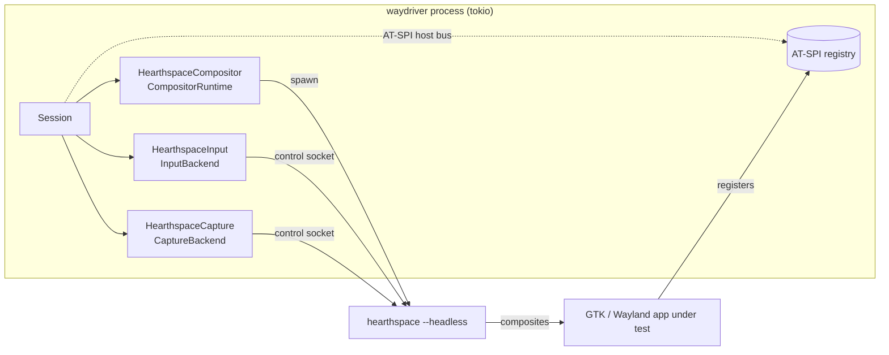

# Headless E2E Testing via WayDriver

Design notes for driving **Hearthspace itself** under
[WayDriver](https://github.com/BohdanTkachenko/waydriver) — a headless GUI test
harness for Wayland — by implementing a custom Hearthspace backend.

The goal is a deterministic, no-display integration harness: boot a headless
Hearthspace, launch a real Wayland client inside it, inject real input, capture
screenshots, and assert against the AT-SPI tree. This complements the unit/
property tests tracked in [TESTING.md](./TESTING.md) with full end-to-end
coverage of the compositor, input routing, decorations, and accessibility
passthrough.

## Background: how WayDriver is structured

WayDriver is backend-agnostic. Its entire compositor-facing surface is three
traits (`crates/waydriver/src/backend.rs`):

| Trait | Responsibility |
| --- | --- |
| `CompositorRuntime` | Spawn/stop a headless compositor; expose `wayland_display()` + `runtime_dir()`. |
| `InputBackend` | Inject keysyms, pointer motion (abs/rel), buttons, and discrete axis. |
| `CaptureBackend` | Screenshots + video. Default path is PipeWire→GStreamer, but `take_screenshot`/`grab_screenshot` are **explicitly overridable** (the docs cite "a future wlr-screencopy backend"). |

Element *location* is done entirely over **AT-SPI on the host session bus** and
is independent of the backend — `session.locate("//Button[@name='ok']")`. The
backend crates do **not** link into the compositor; today `MutterCompositor`
just spawns `mutter --wayland` as a child process and puppets it over D-Bus. Our
backend would spawn the `hearthspace` binary as a child the same way.

WayDriver is Apache-2.0 (license-compatible).

## Why Hearthspace is a *better* fit than Mutter

The Mutter backend is heavy because Mutter is a black box puppeted from the
outside. Hearthspace owns its compositor, so most of that plumbing evaporates:

| Concern | Mutter backend | Hearthspace backend |
| --- | --- | --- |
| Input | `org.gnome.Mutter.RemoteDesktop` D-Bus session, linked to a ScreenCast session just to make absolute pointer motion legal | We **own the Smithay seat** — synthesize events directly into `compositor/input.rs`, no portal/D-Bus dance |
| Capture | private `dbus-daemon` + `pipewire` + `wireplumber` + ScreenCast negotiation | We **own the GLES renderer** — read the framebuffer back to PNG directly |
| AT-SPI | already works (host bus) | **already works** — Hearthspace already integrates AT-SPI (`accessibility.rs`) and ships an a11y test app |
| Control IPC | invented per backend | **already exists** — the shell command socket (`compositor/shell_integration.rs`) |

## The AT-SPI question: a pro for both clients and shell chrome

Testing through AT-SPI is a genuine **pro**, not a con, for the common case:

- For **client windows** running inside Hearthspace, locating widgets via the
  AT-SPI tree means our E2E tests double as an **accessibility regression
  test** — they verify Hearthspace correctly bridges a client's a11y tree to
  the host bus, which is something the compositor already cares about
  (`accessibility.rs` walks exactly this tree). This is real-world a11y coverage
  for free.

Hearthspace's *own* shell chrome is drawn by **Xilem**, whose widget layer
**Masonry** integrates **AccessKit** (`accesskit` is now in `Cargo.lock` via
`masonry_winit`). On Linux AccessKit is bridged to AT-SPI, so the shell's
widgets are expected to expose an AT-SPI tree and be reachable by XPath
locators — unlike the previous shell implementation, which shipped no
AccessKit. The shell
(`shell/xilem_shell.rs`) is a standalone Wayland client, so its a11y tree is
bridged the same way as any other client.

Implications for what we can assert on:

- **Client apps under Hearthspace** — full AT-SPI locator coverage. ✅
- **Hearthspace's shell chrome** — expected AT-SPI coverage via Masonry/AccessKit
  (to be confirmed at runtime); it can also be driven via the existing command
  socket and asserted via **screenshots**.

## Architecture

**Runtime mismatch is a non-issue.** Hearthspace is `async-io`/`calloop`;
WayDriver is `tokio`/`zbus`/`async-trait`. The two runtimes never mix because
they live in **separate processes** communicating over the control socket.
Hearthspace handles commands in its existing calloop source.

## Hearthspace-side status

The compositor-side pieces needed for a first WayDriver backend are now mostly
in place:

1. **Headless backend: implemented.** `hearthspace --headless` starts a
   surfaceless EGL/GLES renderer backed by an offscreen renderbuffer, advertises
   a synthetic Smithay `Output`, opens the deterministic `wayland-99` socket, and
   runs the same calloop-driven compositor state as the nested winit backend.
   `--headless-size WIDTHxHEIGHT` configures the virtual output size,
   `--headless-scale INTEGER` configures the advertised Wayland scale, and
   `--no-shell` skips the Xilem shell client for app-focused harnesses.

2. **Control-protocol extensions: implemented for screenshots and input.** The
   command socket now replies to parsed commands, supports synthetic keyboard,
   pointer, button, and axis events, and returns PNG bytes for `screenshot` via a
   direct GLES framebuffer readback. `quit` provides graceful harness teardown.
   The current keyboard command accepts Linux evdev key codes rather than XKB
   keysyms; a WayDriver adapter can map keysyms before sending, or we can add a
   compositor-side mapping later.

3. **Remaining Hearthspace-side gaps.** The response protocol is intentionally a
   small line-based frame (`ok`, `err`, `ok <byte-count>` + payload), not the
   previously preferred length-prefixed binary envelope. Continuous video is not
   implemented; screenshots are the supported capture path for now.

## Incremental plan

## Implementation notes from autonomous spike

- The repository paths for the referenced planning docs are `todos/BACKENDS.md`
  and `todos/TESTING.md`, not `docs/BACKENDS.md` / `docs/TESTING.md`.
- `--headless` now starts a real Smithay surfaceless EGL/GLES backend backed by
  an offscreen renderbuffer. The virtual output defaults to 1280x720 and can be
  overridden with `--headless-size WIDTHxHEIGHT`. The advertised Wayland output
  scale defaults to 1 and can be overridden with `--headless-scale INTEGER`.
- The command socket now has a minimal line-based response path: parsed commands
  write `ok\n`; unsupported commands that parse but cannot complete write
  `err <message>\n`. This is intentionally smaller than the preferred future
  length-prefixed binary framing, but gives WayDriver backend code a synchronous
  reply mechanism for input commands.
- Implemented input command names are `key-down`, `key-up`,
  `pointer-motion-abs`, `pointer-motion-rel`, `pointer-button-down`,
  `pointer-button-up`, and `axis`. For now `key-down/up` accepts Linux evdev key
  codes (the values from `input-event-codes.h`) rather than XKB keysyms; the
  compositor adds Smithay's expected XKB offset internally. A future WayDriver
  backend can either send evdev codes or add a keysym-to-evdev mapping layer.
- `screenshot` now reads back the current GLES framebuffer on the existing winit
  backend and the new headless backend, then replies as
  `ok <byte-count>\n<PNG bytes>`. A smoke test against `hearthspace --headless`
  returned a valid PNG from the control socket.
- `quit` stops the compositor cleanly over the control socket so harnesses do
  not need to rely on process termination for normal teardown.
- `--no-shell` skips spawning the shell client, which keeps headless WayDriver
  runs focused on the app under test.
- `tests/headless_control.rs` is an ignored integration smoke test for the
  compositor-side protocol. Run it with
  `cargo test --test headless_control -- --ignored` on machines with surfaceless
  EGL support.

### Phase 0 — design + spike ✅

- [x] Validate Smithay headless offscreen rendering (GLES + synthetic `Output`)
      in the compositor; confirm a client can connect and we can read back a
      frame to PNG.
- [x] Decide the control-socket reply protocol (length-prefixed binary vs. a
      small request/response framing) — see Decisions.

### Phase 1 — headless backend ✅

- [x] Add a `Backend::Headless` variant; gate behind a `--headless` flag (and/or
      a cargo feature) with a deterministic `WAYLAND_DISPLAY` + runtime dir.
- [x] Fixed virtual output size from a CLI arg (mirror WayDriver's
      `resolution` / `scale`).
- [x] **Done when:** `hearthspace --headless` runs with no monitor, a client can
      connect, and the process is idle when nothing animates.

### Phase 2 — input + screenshot IPC ✅/⬜

- [x] Extend the control protocol with input + `screenshot` commands and a reply
      channel.
- [x] Synthesize input into the Smithay seat; implement framebuffer→PNG readback.
- [x] Add a control-socket `quit` command for graceful harness teardown.
- [x] Add an ignored integration smoke test that drives input commands,
      captures a screenshot, and quits over the socket.
- [ ] **Done when:** a script can drive a headless client end-to-end (move
      pointer, click, type, screenshot) over the socket.

### Phase 3 — WayDriver backend crates ⬜

- [ ] Implement `HearthspaceCompositor` (`CompositorRuntime`),
      `HearthspaceInput` (`InputBackend`), `HearthspaceCapture` (`CaptureBackend`,
      overriding `grab_screenshot`/`take_screenshot` to bypass PipeWire).
- [ ] Wire them into a `Session` and stand up the first AT-SPI-driven E2E test
      against a real client (e.g. the in-repo a11y test app).
- [ ] **Done when:** a `cargo test` E2E spins up headless Hearthspace, launches a
      client, locates a widget by XPath, clicks it, and asserts on the result.

### Phase 4 — optional follow-ups ⬜

- [ ] Video recording (PipeWire) if needed for CI artifacts.
- [ ] Confirm the Xilem shell's Masonry/AccessKit AT-SPI tree is XPath-locatable at runtime.

## Decisions

- **Where do the backend crates live?** Since the goal is testing Hearthspace
  itself, keep `waydriver-{compositor,input,capture}-hearthspace` **in this
  repo** (e.g. under `tests/` support crates or a workspace member), depending on
  the upstream `waydriver` library crate. Avoids coupling our test harness to
  WayDriver's release cadence. Upstreaming later stays possible (additive
  siblings).
- **Control-socket reply protocol.** Implemented as a minimal request/reply
  protocol over the existing Unix stream: `ok\n`, `err <message>\n`, or
  `ok <byte-count>\n<PNG bytes>` for screenshots. This keeps the current shell
  command model simple while giving tests a binary-safe screenshot path.
- **Headless gating.** CLI flag vs. cargo feature — a runtime `--headless` flag
  keeps a single binary (simpler for the backend to spawn) and avoids a build
  matrix.

## Open questions

- Does Smithay's headless GLES path on our ARM64 VM read back framebuffers
  without a real GBM device, or do we need a software/llvmpipe EGL? **Answered:**
  surfaceless EGL works on the VM, and headless screenshot smoke tests return
  valid PNGs.
- Tokio dev-dependency: the backend crates pull `tokio`/`zbus`/`async-trait`
  into `[dev-dependencies]` only — confirm that doesn't leak into the main build.
- How much CI cost does an E2E suite add, and should it be a separate, opt-in
  job (like WayDriver's own `--ignored` e2e split)?
